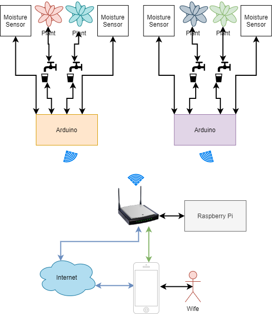
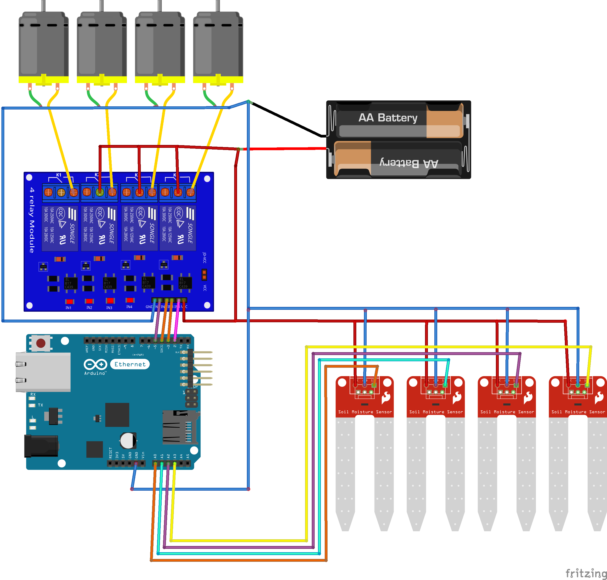

# Watering Can

My wife wanted something to control the humidity of the soil and to "pour" some water for her plants when required. So I decided to play a little with my Arduino and my Raspberry Pi.
I want her to be able to retrieve the humidity and depending on the read decide what to do, so I will use my existing Arduino to read the data and activate the water pump, and my Rasp Pi to host a Java Spring Bott web app to provide her a screen to read the info and activate the pump. Because it is a web app... She can do this from everywhere :) 

## Requirements

* [Arduino Uno WiFi](https://store.arduino.cc/arduino-uno-wiFi-rev2) or [Arduino MKR Wifi](https://store.arduino.cc/arduino-mkr-wifi-1010)
* [Water Pump](https://www.amazon.it/gp/product/B082PM8L6X/ref=ppx_yo_dt_b_asin_title_o01_s00?ie=UTF8&psc=1)
* [Moisture Sensor](https://www.amazon.it/gp/product/B07L2RV1D2/ref=ppx_yo_dt_b_asin_title_o00_s00?ie=UTF8&psc=1)
* [5V Relay Module](https://www.amazon.it/gp/product/B06XRJ6XBJ/ref=ppx_yo_dt_b_asin_title_o00_s00?ie=UTF8&psc=1)
* Or kit [Water Pump + Moistrure Sensor + Relay](https://www.amazon.it/gp/product/B0814HXWVV/ref=ppx_yo_dt_b_asin_title_o01_s00?ie=UTF8&th=1)
* [JDK 11](https://www.oracle.com/java/technologies/javase-jdk11-downloads.html)

***Optional***

* [Raspberry Pi](https://www.raspberrypi.org/products/raspberry-pi-4-model-b/)

## Notes

The water pump that I choose operates with 3V-5V and 100-200mA, the Arduino board does not have enough power to power on the pump. I have to use an external power source just to provide the energy to the pump, and Arduino only to send the On/Off signal.

The Raspberry Pi is not required, I already have one so I decided to deploy on it the Java Spring Boot app. You can use **any** computer with a **running JVM**

## TODO

* Writing the Arudino firmware
    * Start / Stop the pump **(Done)**
    * Read the moisture **(Not implemented yet)**
    * Connect to the Wifi **(Done)**
    * Arduino registration with the SpringBoot app **(Done)**
    * Data exchange with the WebApp **(Partial implementation)**
    * Remote control of the pump **(Done)**
* Writing the Spring Boot app
    * Arduino discovery service **(Done)**
    * Read the data from Arduino **(Partial implementation)**
    * Send commands to Arduino **(Done)**
    * Create a UI to display the data from Arduino **(Done)**
    * Create UI to send comands to Arduino **(Done)**
* Store some config in a File or DB **(Done - Json file)**
* Authentication **(Mmmmm I'll see. VPN is more than enought at the moment)**
* Option to pump XX number of ml of water **(Not implemented yet)**
* Anything else that might come up in my mind (or my wife) :)